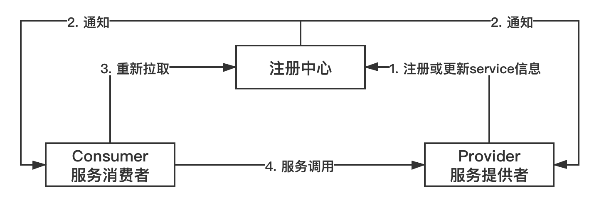
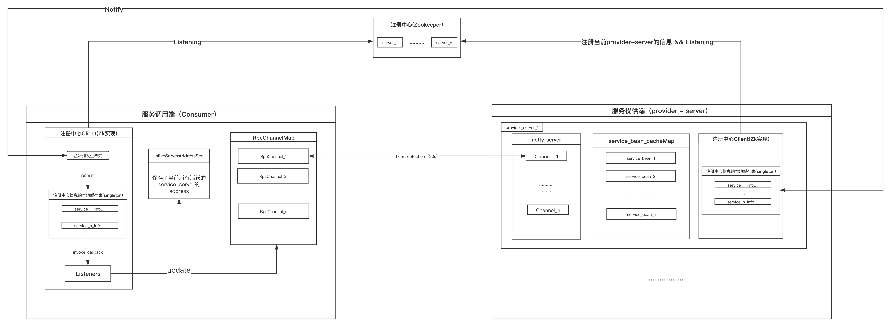
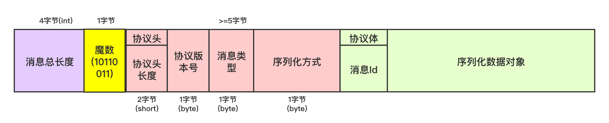
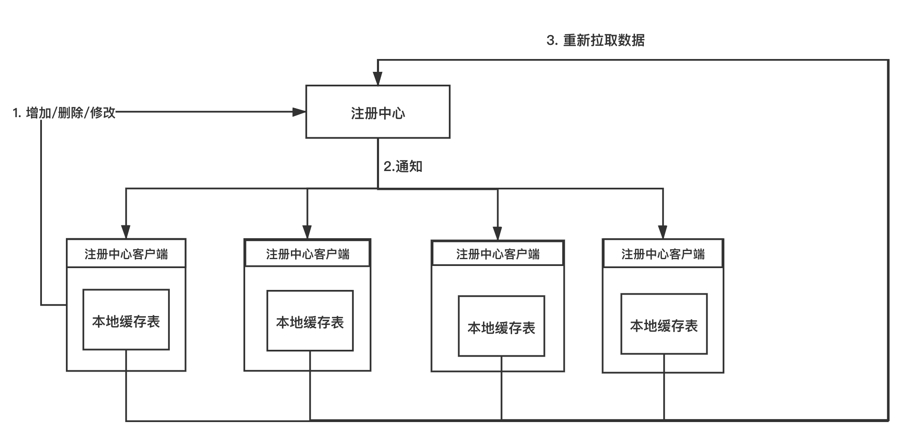
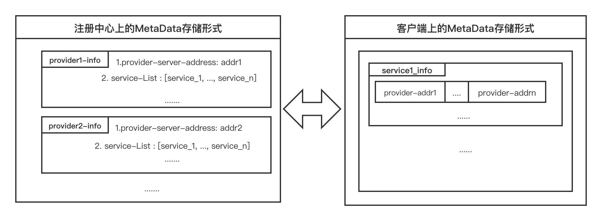

# early-RPC

基于 spring + netty + zookeeper 实现轻量级RPC框架 




# 一、 使用说明

1. properties配置文件信息:

|  key   | value |
|:----|:----|
|erpc.provider.localAddress| provider服务器绑定地址|
|erpc.registry.address| 注册中心的地址|


2. 使用的注解:

|  注解   |  功能 |
|:----|:----|
|  @RemoteInvoke | 用在consumer端，标注在Rpc接口上，会自动为其装入Rpc动态代理对象(类似autowire) |
| @RpcService(class=..., service-name=...[, alias=...]) | 用在provider端，标注在Rpc接口的实现类上，class为Rpc接口对象，service-name为服务的名称，alias选填作为服务的别名 |


# 二、 快速开始

## 第一步：引入pom依赖
**a. consumer端**
```xml
<!-- rpc客户端 -->
<dependency>
    <groupId>com.czf</groupId>
    <artifactId>rpc-client</artifactId>
    <version>1.0-SNAPSHOT</version>
</dependency>

<!-- 演示用例的export包 -->
<dependency>
    <groupId>com.czf</groupId>
    <artifactId>rpc-export</artifactId>
    <version>1.0-SNAPSHOT</version>
</dependency>
```

**b. provider端**
```xml
<!-- rpc服务端 -->
<dependency>
    <groupId>com.czf</groupId>
    <artifactId>rpc-server</artifactId>
    <version>1.0-SNAPSHOT</version>
</dependency>

<!-- 演示用例的export包 -->
<dependency>
    <groupId>com.czf</groupId>
    <artifactId>rpc-export</artifactId>
    <version>1.0-SNAPSHOT</version>
</dependency>
```

## 第二步：配置启动信息
本项目是基于spring启动的，因此无论是consumer端还是provider端, 在启动时的配置阶段，需要做两件事：
1. 让spring扫描到"com.earlyrpc"包
2. 让spring扫描到配置文件

### a. consumer端
1. spring-config.xml
    ```xml
    <?xml version="1.0" encoding="UTF-8"?>
    <beans xmlns="http://www.springframework.org/schema/beans"
           xmlns:xsi="http://www.w3.org/2001/XMLSchema-instance"
           xmlns:context="http://www.springframework.org/schema/context"
           xsi:schemaLocation="http://www.springframework.org/schema/beans http://www.springframework.org/schema/beans/spring-beans.xsd http://www.springframework.org/schema/context http://www.springframework.org/schema/context/spring-context.xsd">
    
    
        <!-- 扫描到包 -->
        <context:component-scan base-package="com.earlyrpc"></context:component-scan>
        
        <!-- 引入配置文件 -->
        <context:property-placeholder location="consumer-config.properties"></context:property-placeholder>
    </beans>
    ```
2. consumer-config.properties
    ```properties
    # 在consumer端配置注册中心的address (ip:port)
    erpc.registry.address=127.0.0.1:2181
    ```

### b. provider端
1. spring-config.xml
    ```xml
    <?xml version="1.0" encoding="UTF-8"?>
    <beans xmlns="http://www.springframework.org/schema/beans"
           xmlns:xsi="http://www.w3.org/2001/XMLSchema-instance"
           xmlns:context="http://www.springframework.org/schema/context"
           xsi:schemaLocation="http://www.springframework.org/schema/beans http://www.springframework.org/schema/beans/spring-beans.xsd http://www.springframework.org/schema/context http://www.springframework.org/schema/context/spring-context.xsd">
    
    
        <!-- 扫描到包 -->
        <context:component-scan base-package="com.earlyrpc"></context:component-scan>
        
        <!-- 引入配置文件 -->
        <context:property-placeholder location="provider-config.properties"></context:property-placeholder>
    </beans>
    ```
2. provider-config.properties
    ```properties
    # provider服务端绑定的ip:port地址
    erpc.provider.localAddress=127.0.0.1:7777
    
    # 在consumer端配置注册中心的address (ip:port)
    erpc.registry.address=127.0.0.1:2181
    ```

## 第三步：启动Zookeeper

下载好zookeeper的压缩包后，运行其bin目录下的启动脚本，作为注册中心.

## 第四步：启动项目

**本次例子的rpc接口**
```java
package com.earlyrpc.export;

/**
 *
 * @author czf
 * @Date 2020/9/24 15:31
 */
public interface HelloService {
    String hello(String name);
}
```

### a. provider端
1. 对rpc服务接口的实现
    ```java
    /**
     * @author czf
     * @Date 2020/9/24 11:09 下午
     */
    @RpcService(value = HelloService.class, serviceName = "hello-service")
    public class Hello implements HelloService{
        public String hello(String name) {
            return "hello, " + name + "~";
        }
    }
    ```

2. provider端的RpcServer启动
    ```java
    package com.earlyrpc.example.provider;
    
    import org.springframework.context.support.ClassPathXmlApplicationContext;
    
    /**
     * @author czf
     * @Date 2020/9/24 11:11 下午
     */
    public class ProviderMain {
        public static void main(String[] args) {
              // rpcServer生命周期与spring上下文容器同步
              new ClassPathXmlApplicationContext("spring-config.xml");
         }
     }
    ```


### b. consumer端
```java
package com.earlyrpc.example.consumer;

import com.earlyrpc.client.annotation.RemoteInvoke;
import com.earlyrpc.export.HelloService;
import lombok.Data;
import org.springframework.context.support.ClassPathXmlApplicationContext;
import org.springframework.stereotype.Component;

/**
 *
 * helloConsumer作为测试bean
 *  
 * @author czf
 * @Date 2020/9/24 11:07 下午
 */
@Data
@Component
public class HelloConsumer {

    // 自动Autowire进rpc服务接口
    @RemoteInvoke
    private HelloService helloService;

    public static void main(String[] args) {
        // 启动spring
        ClassPathXmlApplicationContext app = new ClassPathXmlApplicationContext("spring-config.xml");
        
        // 获取测试bean
        HelloConsumer helloConsumer = app.getBean("helloConsumer", HelloConsumer.class);

        // 获取被RemoteInvoke自动填装的bean
        HelloService helloService = helloConsumer.getHelloService();

        System.out.println(helloService.hello("early-rpc"));
        
        // earlyrpc的生命周期与spring的applicationContext同步
        app.close();
    }
}

```

测试结果:
```
....launch-log....

hello, early-rpc~

....close-log....

```

# 三、 实现细节

## 1. 整体概要


## 2. early-rpc可扩展协议


1. 消息总长度：进行一次rpc所用消息的总长度(注: 消息总长度不包括长度字段自身所占长度)

2. 魔数：用于唯一标示early-rpc协议

3. 协议头（version 1.0）：
    1. 协议头所占长度
    2. 协议版本号
    3. 消息类型
    4. 序列化方式

4. 协议体：
    1. 消息Id
    2. 被序列化的传输对象
    
## 3. 注册中心

erpc(early-rpc)的注册中心模块主要是实现注册中心的客户端，该客户端至少需要2个功能：

1. 对服务元数据的增删查改（ 对应注册服务，下线服务，查询服务，更新服务 ）
2. 元数据被修改时，**触发修改事件**，进行方法回调



同时为了减少不必要的通信开销，该客户端也会在本地缓存注册中心存储的服务元信息(MetaData)，即本地缓存表(LocalCacheTable). 

对于被存储的服务元信息，在注册中心和本地的表现形式也有所不同, 如下图所示




## 4. 服务消费端(Consumer)
服务消费端实现的相关代码在rpc-client模块中. 该模块的主要作用:
> 实现`@RemoveInvoke`注解，使得被其标记的成员类型会自动填装 rpc动态代理对象。

下面简述一下几个实现细节


###  <font color=brown size=4>**扫描@RemoveInvoke**</font> 

通过Spring提供的后置处理器来完成这一功能，通过实现BeanFactory级别的后置处理器`BeanFactoryPostProcessor`来获取底层的IOC容器`BeanFactory`用于之后将rpc动态代理对象注册到容器中.  再通过实现Bean级别的后置处理器`InstantiationAwareBeanPostProcessor`中的`postProcessAfterInitialization`方法（Bean初始化完之后回调该方法），通过遍历每一个Field，来扫描查看是否标记了`@RemoteInvoke`, 如果标记了，则尝试从容器中去取对应的Rpc动态代理Bean，若没有取到则说明还没有创建，就通过`RpcProxyCreator`去创建对应的rpc动态代理对象，再注册到IOC容器中， 最后获取到rpc代理对象后，以反射的形式注入到对应的Field域中.

(对应类`com.earlyrpc.client.config.processor.CreateRPCProxyBeanPostProcessor`)

###  <font color=brown size=4>**使用Proxy创建Rpc动态代理对象**</font> 

在创建代理对象对接口方法进行重写的时候，主要做了以下几个事情:
- 对Object中的一些方法进行过滤或直接返回处理(如:`equals, hashCode, toString`...)
- 根据当前所持有的接口方法信息封装成RpcRequest
- 获取一个rpc-request-sender (从本地缓存表中获取所有提供了当前服务的server地址，并使用`random`方式获取其中的一个)
- 以异步的方式发送rpc-reqeust，获取future对象，从future中拿结果并返回

(对应类`com.earlyrpc.client.proxy.RpcProxy`)

###  <font color=brown size=4>**根据请求活跃度来动态调整长短连接**</font> 

在RPC客户端中，会维护一个连接池管理器(ConnectionManager)的单例, 它主要负责对连接(Channel)的管理，包括创建，维护与销毁. 在ConnectionManager中会和请求频繁的server建立长连接，而对于请求频率比较低的server使用短连接来做;  

实现方式就是rpc-server会监听30s的心跳，如果心跳超时则就判定为不活跃的连接，直接断开与客户端的连接.

###  <font color=brown size=4>**rpc客户端的关闭**</font> 

rpc客户端基于Spring启动，也基于Spring关闭，通过监听SpringContext容器的关闭事件来对客户端进行关闭.


## 5. 服务提供端(Provider)
服务提供端实现的相关代码在rpc-server模块中. 该模块的主要作用:
> 实现`@RpcService`进行服务暴露, 将提供的所有服务信息注册到注册中心上.

### <font color=brown size=4>****服务端主要逻辑****</font>
服务端也是基于Spring启动，在后置处理器的回调里启动RpcServer，在启动过程中做的事情包括:
- 获取所有标记了`@RpcService`的Bean，并包装成serviceBean对象，全部都缓存到一个BeanMap中， 并注册到注册中心上.
- 启动RpcServer (即Netty的启动)
- 当有rpc请求到来时，从serviceMap中获取到对应的serviceBean，并通过反射的方式进行方法调用，根据返回的结果将其包装成RpcResponse进行返回
- 当发生心跳超时事件时，则将与对应客户端的连接断开。
- 当监听到SpringContext关闭的事件时，也随之关闭RpcServer